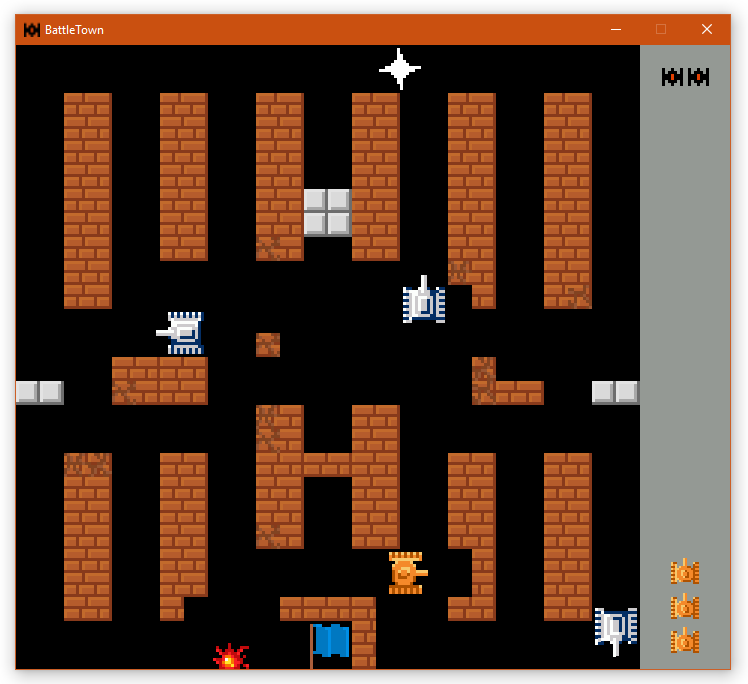
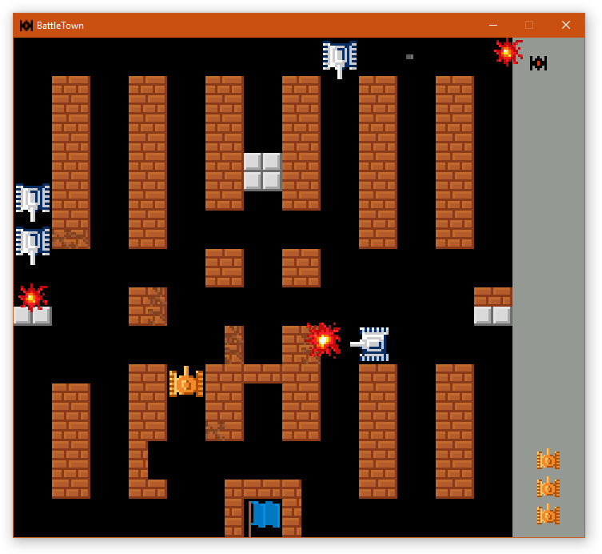
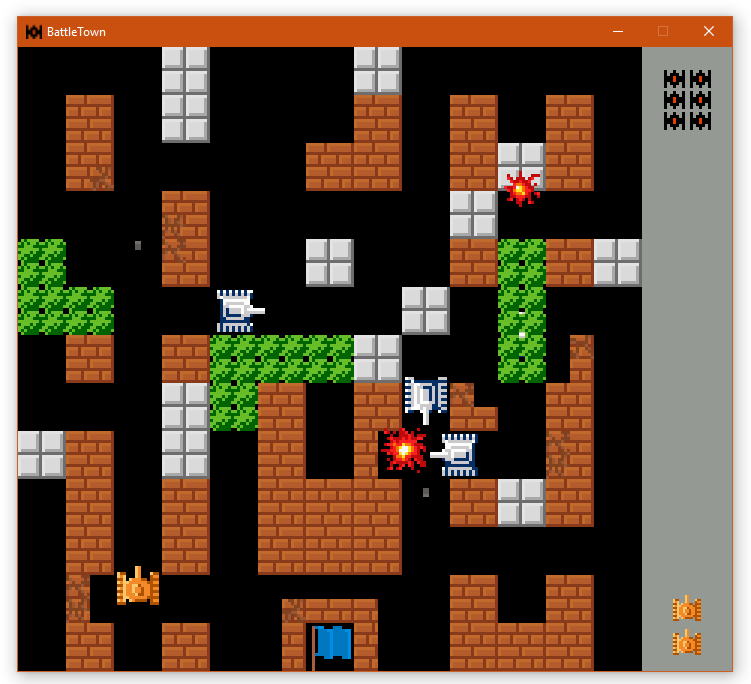
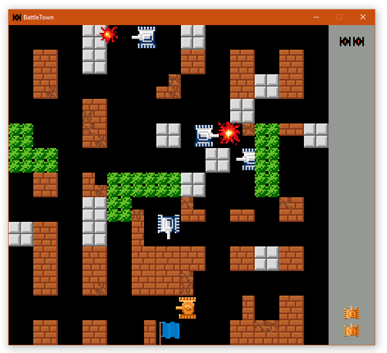

# Battle City 1985
## A clone game written in Python and Pyglet

*Semestral project for the BI-PYT class at Czech Technical University in Prague*

Goal of the project was to create a python clone of the action game BattleCity released in 1985 by Namco for the NES console.

Executable file is *run.py* in the *src* folder.
The game can be started from the root folder using command:

The player's tank is controlled using WSAD keys and SPACE to shoot.
Game level (stage) files are in the *src/stages* folder. The game automatically loads any files in the format:
stage<number>.<any extension> (stage9.txt for example)

